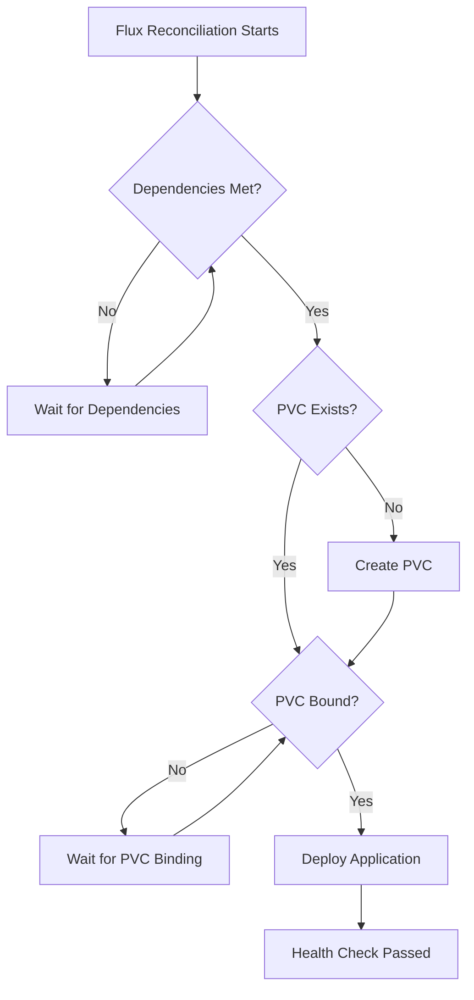

# 📊 PVC Waiting and Health Checks in Flux

This guide covers how to configure Flux to wait for PersistentVolumeClaims (PVCs) to be bound before deploying applications, testing the configuration, and troubleshooting common issues.

## 🎯 Overview

When deploying applications that require persistent storage, it's crucial to ensure the PVC is bound before the pod attempts to schedule. This prevents the common error:

```
0/3 nodes are available: pod has unbound immediate PersistentVolumeClaims
```

## 🔧 Configuration

### Adding PVC Health Checks to Kustomization

Add the following configuration to your Flux Kustomization to wait for PVC binding:

```yaml
# kubernetes/apps/database/cloudnative-pg/ks.yaml
apiVersion: kustomize.toolkit.fluxcd.io/v1
kind: Kustomization
metadata:
  name: &app pgadmin
  namespace: &namespace database
spec:
  # ... other configuration ...

  # Dependencies - ensure required components are ready
  dependsOn:
    - name: cloudnative-pg
      namespace: database
    - name: rook-ceph
      namespace: rook-ceph
    - name: volsync
      namespace: system
    - name: external-secrets
      namespace: security

  # Health check to wait for PVC to be bound
  healthCheckExprs:
    - apiVersion: v1
      kind: PersistentVolumeClaim
      current: status.phase == 'Bound'

  wait: true
```

### Key Components

| Component | Purpose |
|-----------|---------|
| `dependsOn` | Ensures prerequisite components are ready |
| `healthCheckExprs` | Waits for specific resource conditions |
| `wait: true` | Makes Flux wait for health checks to pass |

## 🧪 Testing the Configuration

### 1. Check Kustomization Status

Monitor the Kustomization to see if it's waiting for health checks:

```bash
kubectl get kustomizations.kustomize.toolkit.fluxcd.io -n database pgadmin -o yaml
```

**Expected output when waiting:**
```yaml
status:
  conditions:
  - lastTransitionTime: "2025-01-01T00:00:00Z"
    message: "Health check failed"
    reason: "HealthCheckFailed"
    status: "False"
    type: "Ready"
```

### 2. Verify PVC Status

Check if the PVC exists and its current state:

```bash
# List PVCs in the namespace
kubectl get pvc -n database

# Detailed PVC information
kubectl describe pvc -n database pgadmin
```

**PVC Status Phases:**
- 🟡 `Pending` - Waiting for storage provisioning
- 🟢 `Bound` - Successfully bound to a PersistentVolume
- 🔴 `Lost` - PVC lost its underlying PersistentVolume

### 3. Monitor Pod Scheduling

Verify that pods aren't being created until PVC is bound:

```bash
# Check for pods
kubectl get pods -n database -l app.kubernetes.io/name=pgadmin

# If pods exist, check their status
kubectl describe pod -n database -l app.kubernetes.io/name=pgadmin
```

### 4. Watch Flux Events

Monitor real-time events for your Kustomization:

```bash
kubectl get events -n database --field-selector involvedObject.name=pgadmin --sort-by='.lastTimestamp' -w
```

### 5. Force Reconciliation

Test the configuration by forcing a reconciliation:

```bash
# Force reconciliation
flux reconcile kustomization pgadmin -n database

# Watch the reconciliation process
flux get kustomizations -n database --watch
```

## 🔍 Troubleshooting

### Common Issues and Solutions

#### ❌ PVC Stuck in Pending State

**Symptoms:**
- PVC shows `Pending` status
- No PersistentVolume available

**Check storage class:**
```bash
kubectl get storageclass
kubectl describe pvc -n database pgadmin
```

**Solutions:**
- Verify storage class exists and is default
- Check if storage provisioner is running
- Ensure sufficient storage capacity

#### ❌ Health Check Timeout

**Symptoms:**
- Kustomization shows `HealthCheckFailed`
- Long reconciliation times

**Check Flux controller logs:**
```bash
kubectl logs -n flux-system -l app=kustomize-controller --tail=100
```

**Solutions:**
- Increase timeout in Kustomization spec
- Verify health check expression syntax
- Check resource selectors

#### ❌ Dependencies Not Met

**Symptoms:**
- Kustomization waiting on dependencies
- Resources not being created

**Check dependency status:**
```bash
# Check all dependencies
kubectl get kustomizations -A

# Check specific dependency
kubectl describe kustomization -n system volsync
```

## 📋 Health Check Examples

### Basic PVC Health Check
```yaml
healthCheckExprs:
  - apiVersion: v1
    kind: PersistentVolumeClaim
    current: status.phase == 'Bound'
```

### Multiple Resource Health Checks
```yaml
healthCheckExprs:
  # Wait for PVC to be bound
  - apiVersion: v1
    kind: PersistentVolumeClaim
    current: status.phase == 'Bound'

  # Wait for specific PVC by name
  - apiVersion: v1
    kind: PersistentVolumeClaim
    name: pgadmin
    current: status.phase == 'Bound'

  # Wait for PostgreSQL cluster to be ready
  - apiVersion: postgresql.cnpg.io/v1
    kind: Cluster
    current: status.conditions.filter(e, e.type == 'Ready').all(e, e.status == 'True')
```

## 🔄 Workflow Diagram



## 📊 Monitoring Commands

### Quick Status Check
```bash
# One-liner to check everything
echo "=== Kustomization Status ===" && \
kubectl get kustomizations -n database pgadmin && \
echo -e "\n=== PVC Status ===" && \
kubectl get pvc -n database && \
echo -e "\n=== Pod Status ===" && \
kubectl get pods -n database -l app.kubernetes.io/name=pgadmin
```

### Continuous Monitoring
```bash
# Watch all resources
watch -n 5 'kubectl get kustomizations,pvc,pods -n database'
```

## ✅ Success Indicators

When everything is working correctly, you should see:

1. 🟢 **Kustomization Ready**: `Ready` condition is `True`
2. 🟢 **PVC Bound**: Status shows `Bound`
3. 🟢 **Pod Running**: No scheduling errors
4. 🟢 **No Events**: No "unbound PVC" warnings in events

## 📚 References

- [Flux Kustomization Health Checks](https://fluxcd.io/flux/components/kustomize/kustomizations/#health-assessment)
- [Kubernetes PVC Documentation](https://kubernetes.io/docs/concepts/storage/persistent-volumes/)
- [Storage Troubleshooting Guide](https://kubernetes.io/docs/concepts/storage/troubleshooting/)

---

💡 **Tip**: Always use `wait: true` in your Kustomization when using health checks to ensure proper sequencing.
